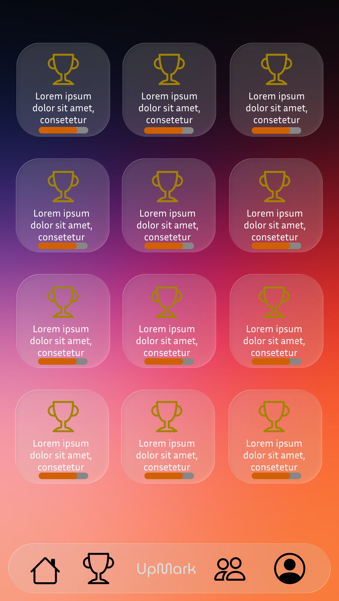
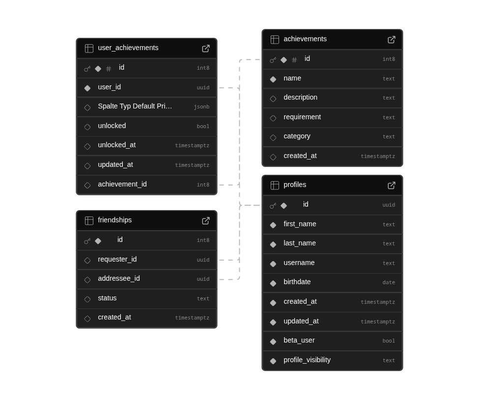

<h1 align="center">RealLife Achievements</h1>

  
  
  
  

  Achievement system for real-world events.

---

<video src="./Konzept/Bilder/Upmark Werbung Finished.mp4" controls></video>

# Die Idee
 Die Idee iste es eine app zu entwickeln die achievements also erfolge wie in Viedeospielen in real life vergibt. So ein ähnliches system gibt es teilweise schon in sammsung health mit Plaketten.

##  Demo & Presentation

  
    </a>

## Achievments

| achivment | wie bekommt man es: | wie wird es erfasst |
|-----|----|-----|
| traveler I | besuche 3 verschiedene Länder | GPS / Standort|
| traveler II | besuche 5 verschiedene Länder | GPS / Standort |
| traveler III | besuche 8 verschiedene Länder | GPS / Standort |
| Tutorial finished | Werde 18 | Geburtsdatum + Zeit |
| Maker | besuche 1 Makerfaire | GPS / Standort und Datum |
| Maker I | besuche 3 Makerfaires | GPS / Standort und Datum |
| Maker II | besuche 5 Makerfaires | GPS / Standort und Datum  |
| bushcamper I | Übernachte eine nacht in der Wildniss |GPS / Standort und Zeit |
| bushcamper II | bleibe länger als 3 Tage in der Wildniss | GPS / Standort und Zeit |
| wanderer |Wandere an einem Tag mehr als 12 km | GPS / Standort und Zeit |
| Wander II | Wandere an einem Tag 18km | GPS / Standort und Zeit |
| Survive Covid 19 | Geboren vor 2021 | Geburstdatum + Zeit |
| Early Bird | Vor 5 Uhr mehr als 200 Schritte | Schritte + Zeit |
| Touch Grass | Mehr als 2 Stunden Druaußen verbracht | Zeit + GPS / Standort |
| Touch Grass II | Mehr als 5 Stunden Draußen verbracht |
| Unknown Chunk Loaded | Ein neues gebiet zum ersten mal betretten (nach einem jahr nutzung)| GPS / Standort |
| Miner I | sei 500 Meter dem unter meerespiegel  | ? |
| Golden Hour | Draußen zwischen sonnenuntergang oder Aufgang | GPS/Standort + Zeit | 
| Weather Resistant | Draußen trotz Regen und unter 5 grad | Wetterbericht API + Standort |
| Offline Mode | 1 Tag Offline | Internettverbindung |
| Autopilot Disabled Anderen Weg als sonst zu gelichem Ziel genommen | Standort |
| Explorer |Mehr als 100 km von zuhause entfernt | Standort |
| Goblin Mode | nach 12 Uhr rausgegangen | Satndort |
| Recovery Day | Weniger als 3000 Schritte an einem Tag | Tag +  Zeit |
| Music Lover | Mehr als 5 Stunden Musik an einem tag gehört | Musikwiedergabe |
| Adventure | Mehr als 20000 Schritte und eine neuer ort +  50km entfernt von Zuhause | Schritte + Standort|

### Detection Logic Overview

- GPS: Standort, Distanz, Höhe
- Time: Tageszeit, Dauer, Account-Age
- Health Data: Schritte
- External APIs: Wetterdaten
- Pattern Analysis: Routenvergleich
- Media API: Musiknutzung

 ## Das Ziel

 Das Ziel ist es die Leute zu anmieren wieder mehr rauszugeben oder zu erleben. 

 Die App soll Später als APK für Android geräte zur verfügung sein so wie als App aus dem Playstore optional vieleicht auch im Playstore. Es soll auf jeden fall auch eine version für wear os geben.

 # Umsetzung

## Design

<table align="center">
<tr>
<td align="center">
<h3>Home</h3>
 
Dein Dashboard mit Fortschritt & Highlights
</td>

<td align="center">
<h3>Achievements</h3>
 
Alle Erfolge im Überblick
</td>

<td align="center">
<h3>Social</h3>
 
Vergleiche dich mit Freunden
</td>
</tr>
</table>

## Backend
Das Backend wird bei Subase auf Servern in Frankfurt gehostet:

hier ist eine visualliesierung der Datenbank: 
 

### Aufbau des backends und der Datenbank:

Im Datatabel Achievments werden Alle Achievmenst gespeichert und verwaltet später vieleicht auch automatisiert über Discordbot über ein Comunity?

beim Spichern der Achievments sieht das dann so aus, hier als Besipsiel die Traveler I und Tutorial Finished Achievments:
|id|name|description|reqiement|category|created_at|
|--------|--------|--------|--------|--------|--------|
|01|Travler I|Besuche 3 verschiedene Länder|countries_visited >= 3|travel|2026-02-21 18:24:49.174175+00|
|02|Tutorial Finished|Werde 18 Jahre alt|age >= 18|milestone|2026-02-21 18:22:33.967152+00|

**Erklärung:**  
**id** eine eindeute id zu jedem Achievment es gibt nimeals die gleiche id für Achievment.  
**name** der Name vom Achievment.  
**description** die BEschreibung vom Achievment.  
**reqiement** was erfüllt sein muss damit ein user das Acheivment hat so wie es in dart später in die if schleife eingebaut wird.  
**category** die Ketegorie vom Achievment mal schauen wa swir damit amchen ist bisher erstnoch eine Idee.  
**created at** der genaue Zeitpunkt wann das Achievment in den Datatebel eingetragen wurde  

#### REALEASE:

Die Veröffentlichung von Upmark ist derzeit für den 19. Juli 2026 geplant. Das genaue Releasedatum kann jedoch je nach Betriebssystem und Entwicklungsfortschritt variieren. Verzögerungen sind möglich, da wir sicherstellen möchten, dass die App auf allen Plattformen stabil, leistungsstark und benutzerfreundlich funktioniert.

Unser Team arbeitet mit voller Motivation und großem Engagement an der Umsetzung dieser Vision. Funktionen werden kontinuierlich weiterentwickelt, das Design optimiert und die App intensiv getestet, um ein hochwertiges Endprodukt zu gewährleisten. Wir freuen uns darauf, Upmark bald mit euch zu teilen und sind gespannt auf den gemeinsamen Start.

### Support & Community
- [Discord](https://discord.gg/6J4Ws5ckYX)

## Star History

<a href="https://www.star-history.com/#Farin25/real-live-achievement&type=date&legend=top-left">
 <picture>
   <source media="(prefers-color-scheme: dark)" srcset="https://api.star-history.com/svg?repos=Farin25/real-live-achievement&type=date&theme=dark&legend=top-left" />
   <source media="(prefers-color-scheme: light)" srcset="https://api.star-history.com/svg?repos=Farin25/real-live-achievement&type=date&legend=top-left" />
   
 </picture>
</a>

 ### Copyright (C) 2026 of [Liam Selent](https://github.com/Lionhacker270411) and [Farin Langner](https://farin-langner.de)
 - Distributed under the terms of the MIT License.